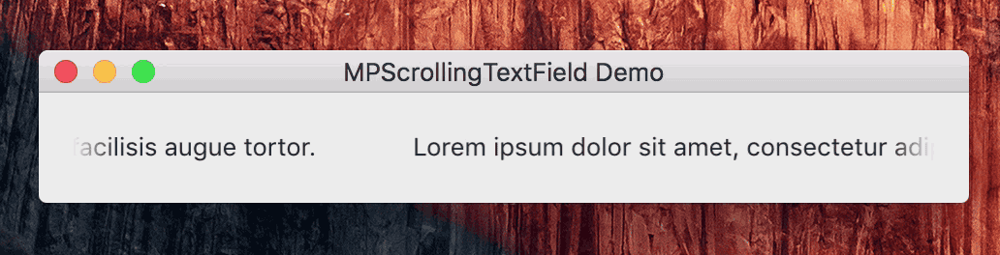

Overview
============

MPScrollingTextField is a drop-in NSTextField replacement with automatic horizontal text scrolling. Currently, you can customize scrolling rate and offset between two text layers used for scrolling.

## Easy To Use

Add MPScrollingTextField to your Xcode project and replace NSTextField classes with MPScrollingTextField in all the labels where automatic scrolling is needed.

## TODO

More customization points

## Author

Denis Stas, [@zyafa](https://twitter.com/zyafa)